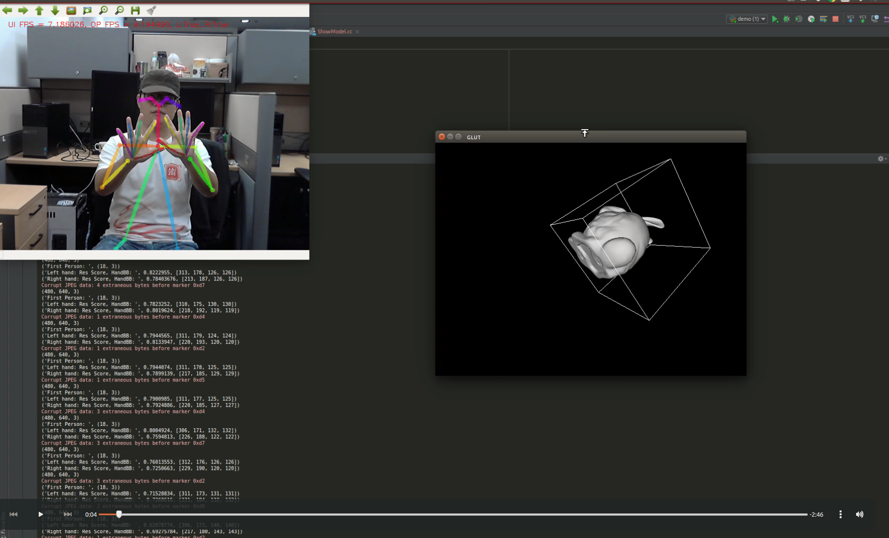

# Human-Computer Interaction Based on Gestures Using Regular Camera

This project contains a HCI system based on hand and pose estimation.

## Dependencies
1. Hardware: GPU and camera
2. Software: [Openpose](https://github.com/CMU-Perceptual-Computing-Lab/openpose), [PyOpenPose](https://github.com/FORTH-ModelBasedTracker/PyOpenPose), Caffe, opencv, opengl, CUDA, wmctrl.

__Note:__ PyOpenPose requires __opencv3.x__. You will have to build openpose with opencv3 as well.

## Installation
1. 1st, you need to Clone and build openpose. If you use cmake then ```make install``` will copy
all necessary headers and libs to an _install_ forder that you specify (default is ```/usr/local```).
```bash
https://github.com/CMU-Perceptual-Computing-Lab/openpose.git
```

Then run cmake and install with the following commands:
```bash
cd openpose
mkdir build
cmake ..
make
```

Set an environment variable named OPENPOSE_ROOT pointing to the openpose _install_ folder.
For running the example scripts make sure OPENPOSE_ROOT contains a models folder with the openpose models.
Create a OPENPOSE_ROOT in you .bashrc file:
```bash
export OPENPOSE_ROOT=/xxx/CamControl_3D_Objects/openpose
```

2. Clone it from my github:
```bash
git clone https://github.com/gujiuxiang/CamControl_3D_Objects.git
```
Then run cmake and install with the following commands:
```bash
cd CamControl_3D_Objects
mkdir build
cmake ..
make
```

Add the folder containing PyOpenPose.so to your PYTHONPATH.
```bash
export PYTHONPATH="$PYTHONPATH:/xxx/CamControl_3D_Objects/build/PyOpenPoseLib"
```

### Building the library for python3 or python2

 - Set WITH_PYTHON3 flag in cmake to True (i.e with cmake-gui).
 - rebuild project


## Testing

We have two important files: ShowModel.cc and scripts/demo.py, you can simply run the scripts:
```
bash run.sh
```
or
```
make clean && make
python scripts/demo.py
```

The default setting is camera input. If you want to run the downloaded video, comment ```cap = cv2.VideoCapture(0)``` and use ```cap = cv2.VideoCapture('test.mp4')```.

## Visualization Results
[](http://jxgu.cc/project/cam_3d_pose.mp4)
